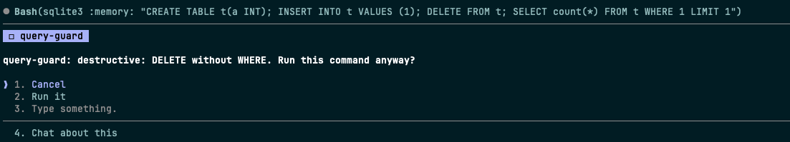
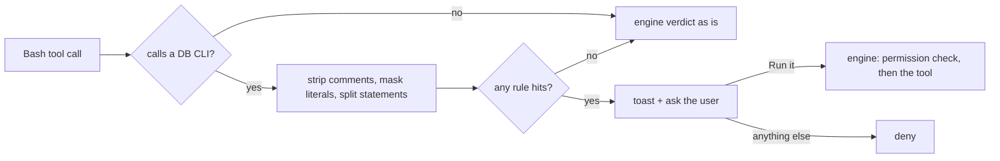

<div align="center">

# query-guard

A guard rail for SQL in Claude Code. Before Claude runs a destructive or slow-looking query through a DB CLI, you get a toast and a question only you can answer, in every permission mode.




</div>

## Why

Allow rules such as `Bash(psql:*)` make database work smooth, and they also wave through `DELETE FROM users` or a `SELECT *` over a billion-row table. Auto mode goes further and lets a classifier approve calls for you. query-guard reads the SQL in the command and puts every risky call back in front of you, whatever the allow rules or the permission mode would have decided.

## Quick start

1. Turn on function hooks (early access, Claude Code 2.1.280+) in `~/.claude/settings.json`:

   ```json
   { "env": { "CLAUDE_CODE_ENABLE_FUNCTION_HOOKS": "1" } }
   ```

2. Install, from your shell or inside a session:

   ```bash
   claude plugin marketplace add nu0ma/query-guard
   claude plugin install query-guard@nu0ma
   ```

   ```
   /plugin marketplace add nu0ma/query-guard
   /plugin install query-guard@nu0ma
   ```

3. Start a new session. There is nothing to configure.

## What it catches

query-guard looks only at Bash commands that call one of these CLIs:

`psql` · `mysql` · `mariadb` · `sqlite3` · `duckdb` · `bq` · `spanner-cli` · `spanner-readonly-cli` · `clickhouse-client` · `gcloud spanner databases execute-sql`

### Destructive

| Rule | Example |
| --- | --- |
| `DELETE` (flagged louder without `WHERE`) | `DELETE FROM users` |
| `UPDATE` without `WHERE` | `UPDATE orders SET status = 'x'` |
| `DROP TABLE / DATABASE / SCHEMA / INDEX / VIEW / COLUMN` | `DROP TABLE events` |
| `ALTER TABLE ... DROP` | `ALTER TABLE t DROP c` |
| `TRUNCATE` | `TRUNCATE events` |

### Possibly slow

| Rule | Example |
| --- | --- |
| `SELECT ... FROM` without `WHERE` or `LIMIT` | `SELECT * FROM events` |
| `CROSS JOIN` | `SELECT * FROM a CROSS JOIN b` |
| Comma join without `WHERE` | `SELECT * FROM a, b` |
| `LIKE` with a leading wildcard | `WHERE name LIKE '%foo'` |
| `ORDER BY` without `LIMIT` | `SELECT id FROM t WHERE a = 1 ORDER BY id` |

Several hits are joined into one reason, for example `query-guard: destructive: DELETE without WHERE / possibly slow: LIKE with leading wildcard`.

### What it leaves alone

- Commands that call no DB CLI: `echo "DELETE FROM users"` passes untouched.
- Keywords inside SQL comments (`-- DELETE ...`, `/* ... */`) and string literals (`WHERE note = 'DROP TABLE x'`).

## How it works

<details>
<summary>From the Bash call to the dialog</summary>



query-guard is a single `tool.call` hook on `Bash`. For a risky command it asks you through Claude Code's own question dialog (`$.ui.ask`) before the permission check runs, so no permission mode, allow rule or auto-mode classifier can answer for you. Only `Run it` lets the call go on to the normal permission flow; `Cancel`, any other answer, a dismissed dialog, or a headless `-p` run with nobody to ask denies it. `Cancel` is listed first so a dialog that resolves on its own lands on it.

Detection is static and regex-based. It never connects to a database, and the plugin has no dependencies: no `package.json`, nothing to install.

</details>

## Limitations

<details>
<summary>Known limits</summary>

- Function hooks are early access, and their API may change between Claude Code releases.
- SQL read from a file (`psql -f file.sql`, `mysql < file.sql`) is not inspected; only the command text is.
- "Possibly slow" is a guess: query-guard does not know how big a table is, so `SELECT * FROM small_lookup` asks too.
- Regex matching can miss or over-report, for example a `WHERE` that only appears inside a subquery.
- In default mode without an allow rule for the command, approving `Run it` is followed by the usual permission prompt, so you answer twice.
- In a headless `-p` run every risky command is denied, since nobody can answer.

</details>

## Development

```bash
claude --plugin-dir plugins/query-guard        # load this checkout; saving reloads it
claude plugin validate .
claude plugin validate plugins/query-guard
claude plugin test plugins/query-guard
```

Once the mod has loaded, Claude Code writes its type declarations to `plugins/query-guard/.claude-plugin/types/` (ignored by git), and `tsc -p plugins/query-guard` type-checks it. Bump the version in `plugins/query-guard/.claude-plugin/plugin.json` and add a `CHANGELOG.md` entry with each release, since installed copies update only when the version changes.

## License

[MIT](LICENSE)
